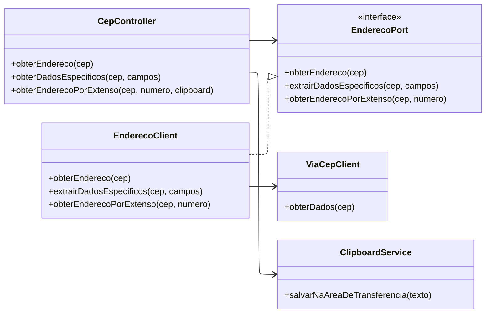
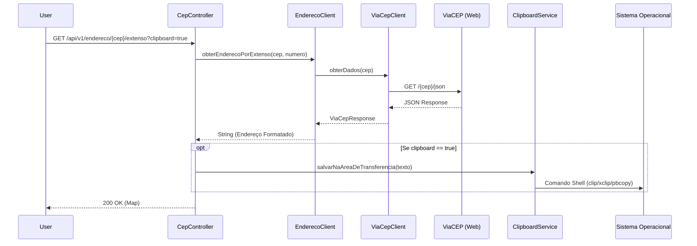

# Documentação da API de Consulta de Endereços (GraalVM)

## Visão Geral

Esta aplicação é um serviço REST que fornece informações de endereços baseados no CEP (Código de Endereçamento Postal)
brasileiro. A aplicação consome a API externa ViaCEP e expõe endpoints para consulta completa, consulta de campos
específicos e formatação de endereço por extenso, com capacidade de interagir com a área de transferência do sistema
operacional.

A aplicação foi projetada para ser compatível com GraalVM Native Image, incluindo configurações de reflexão para tempo
de execução.

## Arquitetura

O projeto segue uma estrutura baseada em camadas e Ports and Adapters (Arquitetura Hexagonal), separando o domínio da
infraestrutura.

### Diagrama de Classes (Estrutura)

### Fluxo de Execução (Sequence Diagram)

O diagrama abaixo ilustra o fluxo de uma requisição para obter o endereço por extenso e salvar no clipboard.

## Endpoints da API

A API base está mapeada em /api/v1/endereco/{cep}.

### Obter Endereço Completo

Retorna o objeto de domínio `Endereco` completo mapeado a partir da resposta do ViaCEP.

* **Método:** `GET`
* **URL:** `/api/v1/endereco/{cep}`
* **Resposta:** JSON contendo rua, complemento, bairro, cidade, uf e estado.

### Obter Dados Específicos

Permite filtrar quais campos do endereço o cliente deseja receber.

* **Método:** `GET`
* **URL:** `/api/v1/endereco/{cep}/dados`
* **Query Params:**
    * **`nome_campo` (Múltiplos):** Nome dos campos do JSON original do ViaCEP que se deseja retornar.
* **Exemplo:** `/api/v1/endereco/01001000/dados?nome_campo=logradouro&nome_campo=localidade`
* **Implementação:** Utiliza `ObjectMapper` para converter a resposta e filtrar dinamicamente as chaves solicitadas.

### Obter Endereço por Extenso (com Clipboard)

Retorna o endereço formatado em uma string única e, opcionalmente, copia o texto para a área de transferência do
servidor/máquina onde a aplicação está rodando.

* **Método:** `GET`
* **URL:** `/api/v1/endereco/{cep}/extenso`
* **Query Params:**
    * **`numero` (int):** O número do imóvel (obrigatório).
    * **`clipboard` (boolean):** Se true, salva o texto na área de transferência.
* **Formato de Saída:** `Logradouro, Numero - Bairro, Cidade - UF, CEP`.

## Componentes Chave

### ClipboardService

Este serviço interage diretamente com o processo do Sistema Operacional para acessar a área de transferência. Ele
detecta o SO e executa o comando apropriado:

* **Windows:** Usa o comando `clip`.
* **Linux:** Usa `xclip -selection clipboard` (Requer instalação do xclip).
* **Mac:** Usa `pbcopy`.

> **Nota:** Se houver falha no processo, uma `ClipboardException` é lançada.

### Cliente HTTP e Logging

A aplicação utiliza o `RestClient` do Spring Framework. Existe uma configuração personalizada (`RestClientConfig`) que
adiciona um interceptor de logging (`loggingInterceptor`).

* O interceptor lê o corpo da resposta para logar o status e o conteúdo.
* Para evitar que o stream da resposta seja consumido e fique indisponível para o restante da aplicação, ele utiliza um
  rapper `ClientHttpResponseWrapper` que armazena os bytes em memória.

### Suporte a GraalVM Native Image

A classe `NativeImageConfig` implementa `RuntimeHintsRegistrar`. Isso é necessário porque o Jackson (biblioteca JSON)
usa
reflexão para serializar/deserializar o DTO `ViaCepResponse`. A configuração registra explicitamente campos,
construtores
e métodos para reflexão na imagem nativa.

### Tratamento de Erros

* **ViaCepException:** Lançada quando a API externa retorna um erro HTTP (status 4xx ou 5xx).
* **ClipboardException:** Lançada se houver falha ao executar o processo de cópia no sistema operacional.

## Modelos de Dados

### **Endereco (Domínio Interno)**
Modelo simplificado exposto para o cliente final. 
* `rua`, `complemento`, `bairro`, `cidade`, `uf`, `estado`.

### ViaCepResponse (DTO Externo)
DTO que mapeia a resposta exata da API do ViaCEP (referenciado nos clients e mappers).